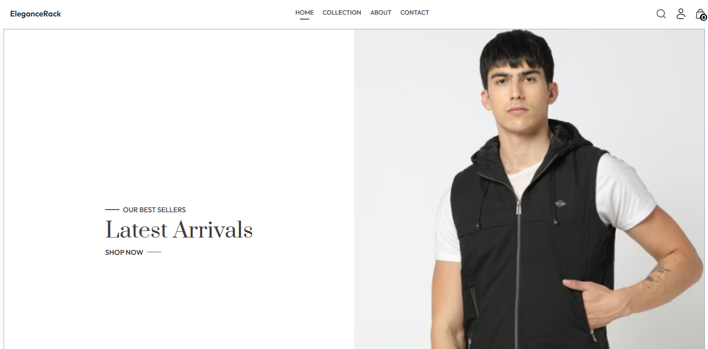
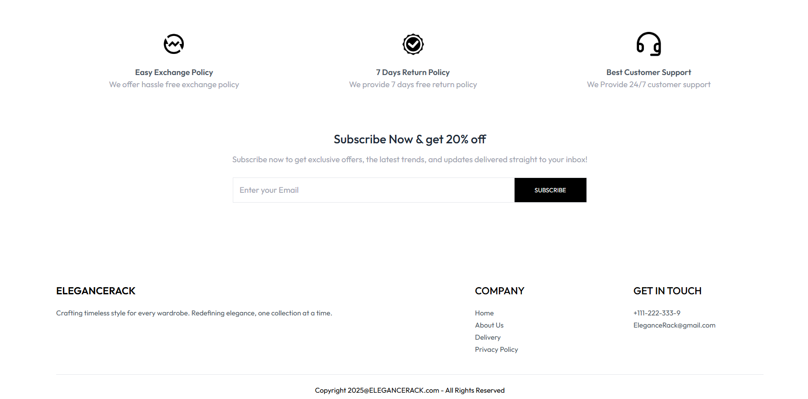
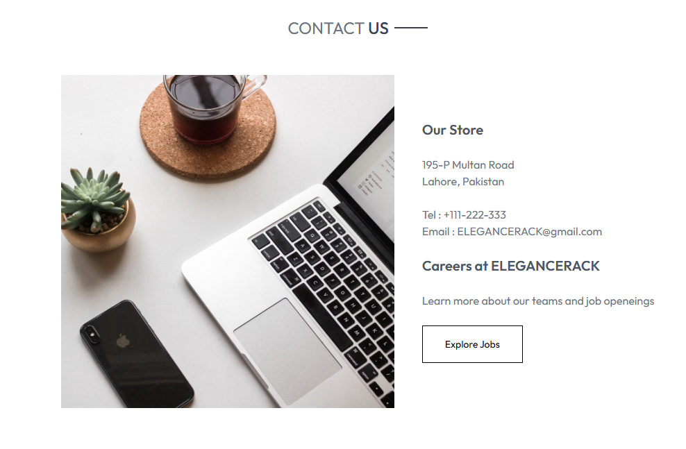
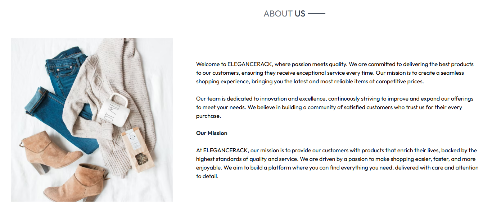

# Elegance Rack Online Clothing Store

### 1. Roll Numbers & Student Names
- *Mateen Abid* (21L-6240)  
- *Taha Saqib* (21L-5673)

### 2. Project Name
*Elegance Rack Online Clothing Store*

### 3. Overview
Elegance Rack is a *MERN stack full-stack eCommerce application* designed to provide users with a seamless online shopping experience. It features a responsive interface for browsing, filtering, and purchasing clothing items, secure payment gateways, and an admin panel for inventory and order management. The project emphasizes scalability, security, and user-centric design.

### 4. Key Features

#### Fundamental Business Logic
- Product listing with search, filtering (category, price), and sorting.
- Shopping cart and checkout system with payment integration.
- Admin panel for product management (CRUD operations) and order tracking (status updates).
- User authentication (login/signup) and role-based access control (admin vs. customer).
- Cloud database (MongoDB) for storing user, product, and order data.

#### Personal Productivity
- User profiles with order history and status tracking.
- Intuitive UI/UX with responsive design for multi-device optimization (desktop, tablet, mobile).
- Clear product details (images, descriptions, reviews) for informed purchasing decisions.

#### Collaboration
- Admin-customer interaction via order status updates (e.g., "shipped," "delivered").
- Contact page with company information and email integration.

#### Additional Core Features
- *Dashboard with Navbar/Sidebar*: Navbar for site navigation, admin panel as dashboard.
- *Login/Sign Up*: Secure authentication using encrypted passwords.
- *Multi-Device Optimization*: Responsive frontend built with React and Tailwind CSS.
- *Contact Information*: Dedicated "Contact Us" page with address, email, and phone.
- *UI/UX Design*: Clean, modern interface with easy navigation.
- *Security*: Secure payment processing and authentication.
- *CRUD Operations*: Admin can add/remove products; users update profiles.
- *Search Functionality*: Keyword-based product search.
- *Error Handling*: Boundary value analysis for login/signup fields.
- *User Profiles*: Profiles display order history and details.

### 5. Conclusion
This project implements core e-commerce functionalities while addressing key requirements such as security, CRUD operations, and user productivity using the powerful MERN stack.

### 6. User Interface Preview

Below are some screenshots of the Elegance Rack application showcasing the user interface:

  

  

  

  
